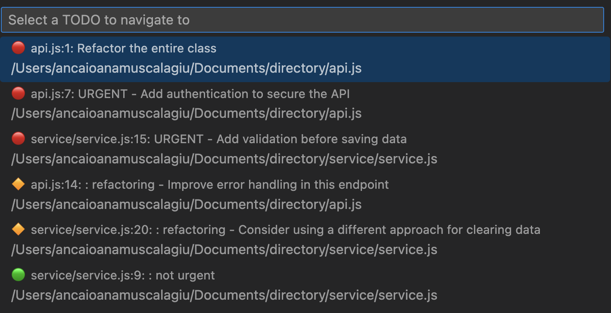

# TODO Code Tracker Extension

"TODO Code Tracker" extension is designed to help developers manage and prioritize TODO comments in their JavaScript and TypeScript projects in Visual Studio Code.

## Features

TODO Code Tracker enhances your productivity by providing two key features:

- **Autocomplete TODO Comments**: Automatically suggests `TODO-HIGH`, `TODO-MEDIUM`, or `TODO-LOW` as you type `TODO` in your code, allowing you to set the priority of your task directly.

- **Find TODOs Command**: Scans your project for all TODO comments and displays them in a list, organized by priority. The priority is either deduced by the keywords 'TODO-HIGH', 'TODO-MEDIUM', 'TODO-LOW' or automatically estimated using an ML model. This list is accessible via the Command Palette or through Ctrl+Alt+T ( or Cmd+Alt+T for macOs ) keyboard shortcut, and clicking on a TODO item will navigate you directly to the file and line where the TODO comment is written.

### Screenshots

#### Autocomplete Feature

#### Find TODOs Command

## Requirements

This extension requires Python > 3.9 and `pip` > 21.2.4 for the machine learning model to run inference. If these versions are not available, TODOs that lack a specified priority keyword will automatically be considered of the least priority, as in version 1 of the extension, where priority prediction was not available.

Kepp in mind that the Extension will use your local Python installation to aquire the necessary packages to run the inference endpoint!

Additionally, the extension requires Visual Studio Code version 1.80.0 or higher. It works seamlessly with the most recent versions of Visual Studio Code.

## Extension Settings

Currently, the TODO Code Tracker does not require any specific settings adjustments. It works out of the box with the default configuration.

## Known Issues

- Occasionally, the TODO list may not refresh automatically if TODO comments are added or modified. A manual refresh of the list might be necessary.

## Release Notes
### 1.0.0

Initial release of TODO Code Tracker.

- Autocomplete for `TODO-HIGH`, `TODO-MEDIUM`, `TODO-LOW`.
- New command "Find TODOs" that lists and prioritizes TODO comments in your project.

### 2.0.0

Enhanced release of TODO Code Tracker with machine learning-based priority estimation.

- Automatically assigns priority levels to TODO comments without a specified priority keyword, based on the comment's content.

**Enjoy using TODO Code Tracker to efficiently manage and navigate your coding tasks!**
